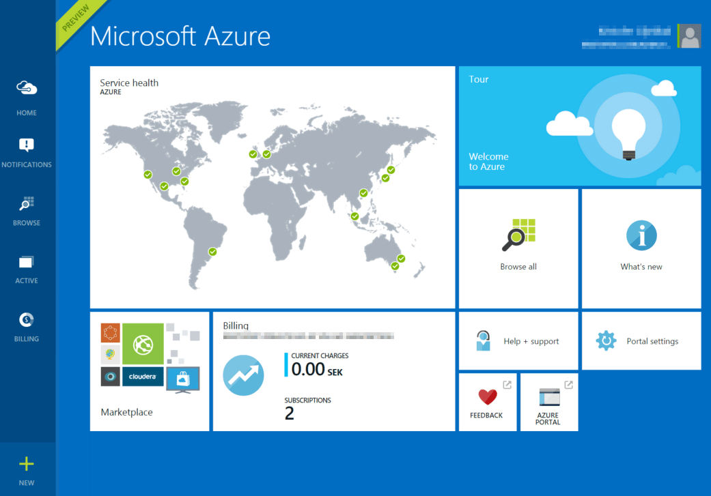
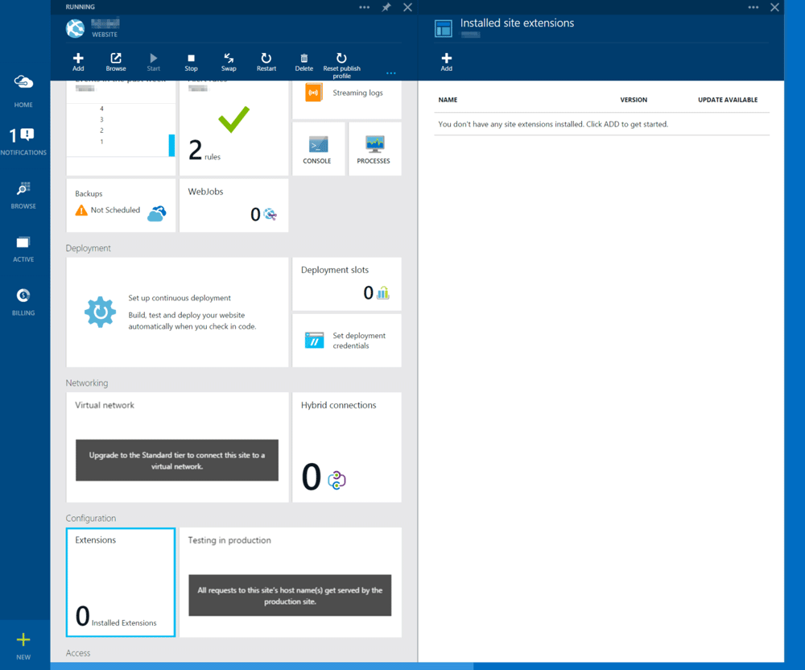
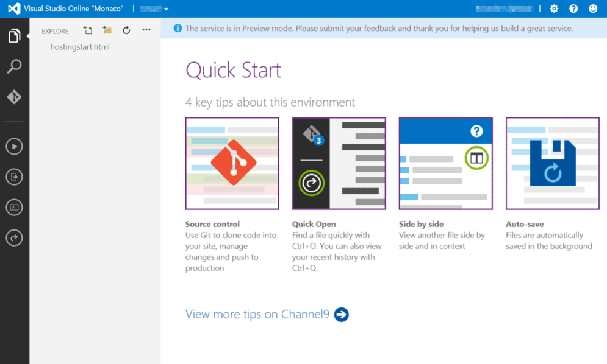
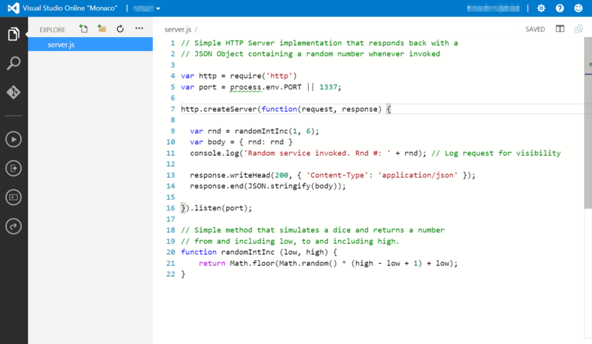

Creating and Calling a Custom REST API with Azure WebSites
==========================================================

"Azure Websites is a fully managed Platform-as-a-Service (PaaS) that enables you to build, deploy and scale enterprise-grade web Apps in seconds. Focus on your application code, and let Azure take care of the infrastructure to scale and securely run it for you."

You'll create a custom RESTful Web Service using Node.js and host it in Azure WebSites. Afterwards we will connect to and consume that service from your Tessel microcontroller.

Prerequisites
-------------

In order to successfully complete this lab you need to:

* Have successfully setup your Azure Subscription, your development environment and your Tessel according to instructions outlined in the [Setup Lab](../_setup).

Instructions
------------

Durin this lab we will use the new [Azure Portal](http://portal.azure.com) for all server side activities, including:

* Creating an Azure WebSite
* Writing a simple Node.js RESTful Web Service
* Invoking and debugging our service

Even though we will be doing this from within the Azure Portal there are plenty of other ways you can achieve the same thing, for example: create the website using Azure-CLI (Azure x-plat), deploy custom code using Git, etc. Have a look at the section about additional references at the end of this lab for more information.

### Creating a new Azure Website

* Start by logging in to the [Azure Portal](http://portal.azure.com).

Since the portal is higly customizable and also evolves at a high pace, chanses are that it might not look exactly the same as on the picture, but they basics should be there.

* Press the "+ NEW" button, located in the lower left corner and select Website from the list.
* Fill in the URL to your new Website and press the "Create" button when you are done. (Feel free to change whatever other options you want to change. Perhaps you want the location to be something different?)

After a while, you'll get a notification that your website is all setup and ready for you to deploy code to.

* Familiarize yourself with the information you have in front of yourself. From here you can manage scaling, monitoring, deployments, etc. so you will come back here from time to time.
* While looking at the portal for your website, find the section called "Configuration" and "press the tile "Extensions"

That will bring out a new "blade" where you can see any "site extensions" you've installed. In order to create our Node.js web service we are going to use a Site Extension called Visual Studio Online (code name Monaco) to create and edit code directly from the portal. Remember, this is just one way of doing it and perhaps not the way you choose to do later on or when running a service in production.

* Click "+ Add" to add a new "Site Extension" to your website
* Select Visual Studio Online" as the extension to add
* Read and accept the legal terms"
* Press the "OK" button when you are done

You've just installed a Site Extension to your Azure Website from a gallery of allready existing extensions. If you want to you can create and install site extensions of your own to extend the functionality of your websites.

Now that we have the Visual Studio Site Extension installed, it's time for us to use it in order to write some code.

* Click on the "Visual Studio Online" site extension
* Click "Browse" button" at the top of the new "blade" that just opened

A new browser windows or tab will open and we are now browsing to your newly installed Site Extension on top of your Azure Website. You are automatically signed in as administrator, but other visitors will have to logon in order to access these features.

The site extension "Visual Studio Online" allows us to create and edit content online only using a web browser. It's like your normal IDE hosted on top of your Website. On the left side you'll find a couple of command buttons that helps us invoke different features. The top most button lets us explore our website and as you can see there is allready a file created for us, "hostingstart.html".

### Writing the server side code

 During this lab, we will develop a simple RESTful API that returns a random number between 1 and 6 whenever it get's a request. Even though we could do this using any supported programming language, we will use JavaScript/Node.js in order to have a similar experience as when we develop for the Tessel.

Let's implement the service!

* Remove the file "hostingstart.html" by right clicking on it and selecting delete.
* Add a new file by clicking the "New File Icon" in the "Explorer Section" and name the file server.js

As soon as you have selected a file, you can imediately start editing that file.

**WARNING! Visual Studio Online will automatically save your files and since you currently are editing the live version of our Website, your changes will take action imediately. This lab focuses on the collaboration between the Tessel device and Azure and does not provide guidance around how to best handle real life Application Lifecycle Management. There are many guides and white papers that goes through that and Azure Website is very well prepaired to handle those scenarios as well**

* Copy and paste the code from [api/server.js](api/server.js) into your newly created file in Visual Studio Online. Visual Studio Online will save your changes automatically so you don't have to save your file.

You should see something like the below image

* Press the "Run" button on the left side of the window

Behind the scene information: Visual Studio Online and Azure Web Site senses that we are about to start a Node.js application. Azure Websites runs on top of Internet Information Server, IIS, and in order to host a Node.js application we need to configure iisnode. The good thing is that this is done automatically for us by adding and configuring the web.config file that you'll see in the Explorer window later on.

You'll be redirected to your website and if everything works according to plans, you'll be greeted with a JSON document, containing a random number between 1 and 6.

* Invoke the service multiple times and watch how the random number changes.
* Go back to Visual Studio Online and see how an output window has opened next to your code. Look at how logs get written everytime you invoke your service.

Congratulations, you have now created, hosted and invoked a custom Web Service using Node.js and Azure Websites.

Summary
-------

More information
----------------

* [How to Deploy an Azure Website](http://azure.microsoft.com/en-us/documentation/articles/web-sites-deploy/)
